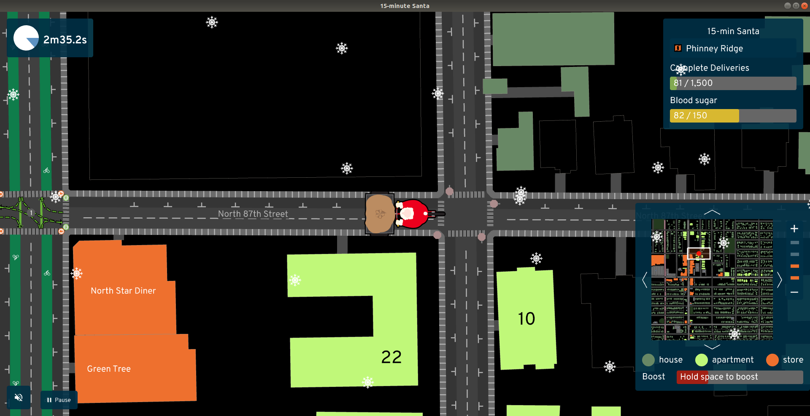
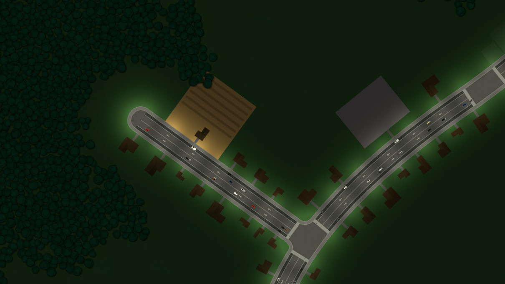
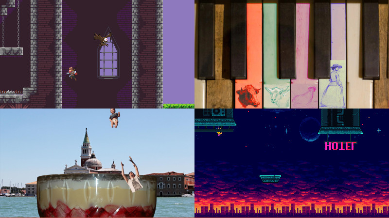
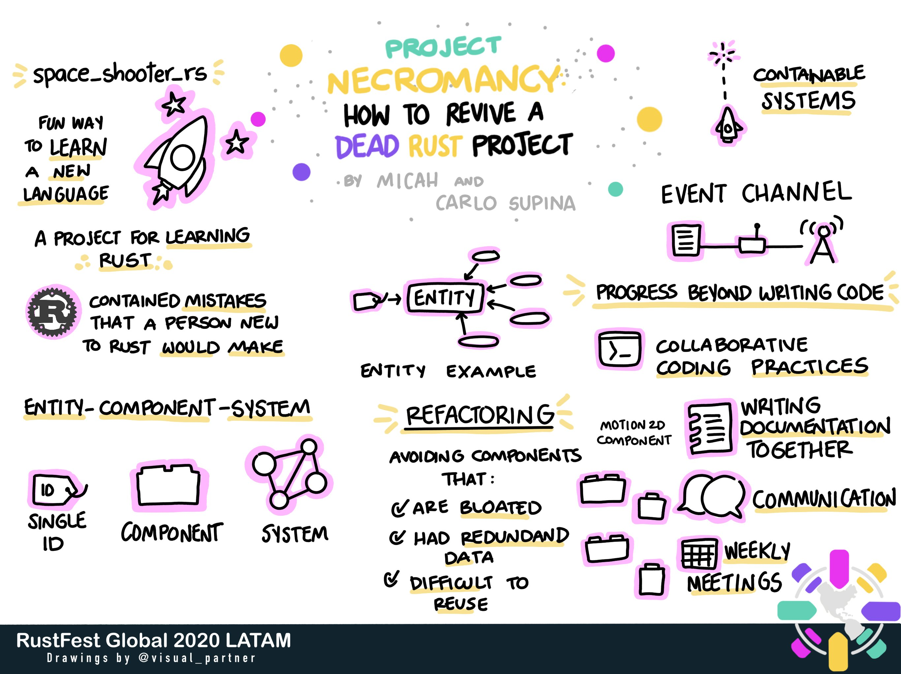
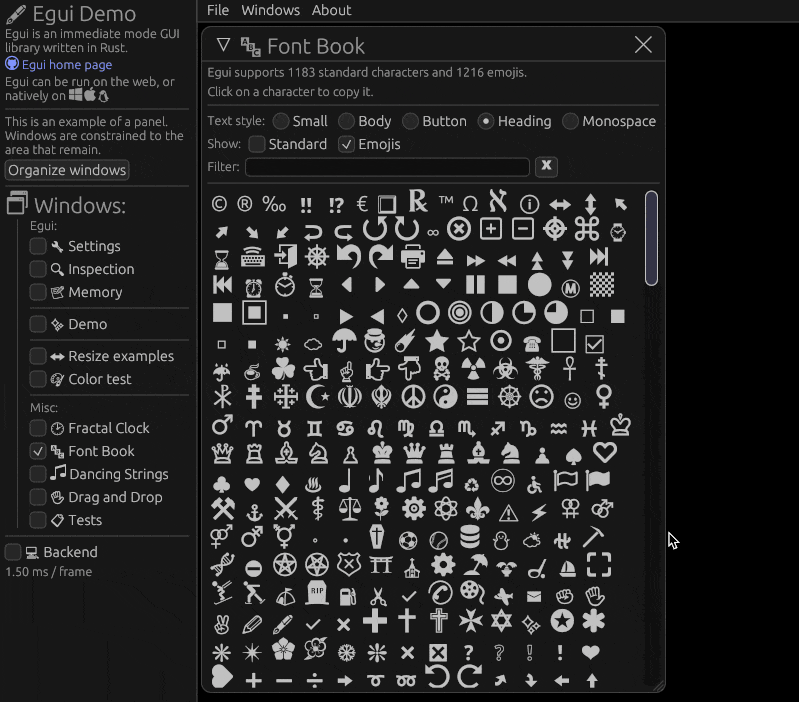
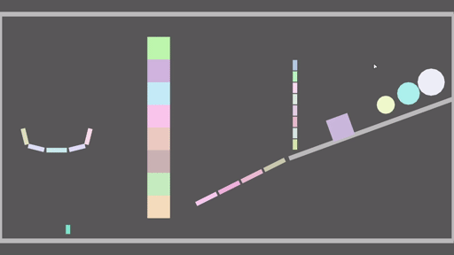
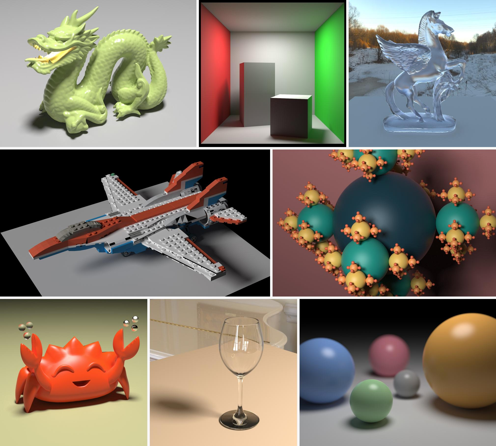

+++
title = "This Month in Rust GameDev #17 - December 2020"
date = 2021-01-04
transparent = true
draft = true
+++

<!-- Check the post with markdownlint-->

Welcome to the 17th issue of the Rust GameDev Workgroup's
monthly newsletter.
[Rust] is a systems language pursuing the trifecta:
safety, concurrency, and speed.
These goals are well-aligned with game development.
We hope to build an inviting ecosystem for anyone wishing
to use Rust in their development process!
Want to get involved? [Join the Rust GameDev working group!][join]

You can follow the newsletter creation process
by watching [the coordination issues][coordination].
Want something mentioned in the next newsletter?
[Send us a pull request][pr].
Feel free to send PRs about your own projects!

[Rust]: https://rust-lang.org
[join]: https://github.com/rust-gamedev/wg#join-the-fun
[pr]: https://github.com/rust-gamedev/rust-gamedev.github.io
[coordination]: https://github.com/rust-gamedev/rust-gamedev.github.io/issues?q=label%3Acoordination

[Rust]: https://rust-lang.org
[join]: https://github.com/rust-gamedev/wg#join-the-fun

Table of contents:

- [Game Updates](#game-updates)
- [Learning Material Updates](#learning-material-updates)
- [Library & Tooling Updates](#library-tooling-updates)
- [Popular Workgroup Issues in Github](#popular-workgroup-issues-in-github)
- [Requests for Contribution](#requests-for-contribution)
- [Jobs](#jobs)

<!--
Ideal section structure is:

```
### [Title]


_image caption_

A paragraph or two with a summary and [useful links].

_Discussions:
[/r/rust](https://reddit.com/r/rust/todo),
[twitter](https://twitter.com/todo/status/123456)_

[Title]: https://first.link
[useful links]: https://other.link
```

If needed, a section can be split into subsections with a "------" delimiter.
-->

## Game Updates

### [Way of Rhea has a Discord!][wor-discord]


_Updated visuals for interactive items._

[Way of Rhea][wor-website] is a puzzle platformer that takes place in a world
where you can only interact with objects that match your current color. The game
is being developed in a custom built Rust game engine and hot swappable
scripting language.

This month's updates:

- More progress has been made on the hub world! The game is no longer fully
  linear.
- All interactive elements are getting a visual update, pictured above.
- The devs have created [a Discord server][wor-discord] where you can hang out,
  stay up to date on the latest developments, and if you're interested, chat
  about the implementation (see the `#tech` channel.)

[wor-discord]: https://discord.gg/JGeVt5XwPP
[wor-website]: https://anthropicstudios.com/way-of-rhea

### [15-minute Santa][15m-santa]



In [15-minute Santa][15m-santa], you deliver presents around a city,
occasionally stopping at a restaurant to refuel -- biking uphill in the snow
isn't easy! The game uses real data from OpenStreetMap and local GIS sources to
know where shops, single-family homes, and apartments are located. In places
where zoning rules keep people separated from food, Santa will have a hard
time.

15-minute Santa was created by the [A/B Street](abstreet) team as an experiment
to see how quickly we could build a simple arcade game that gets people
thinking about how their city is designed. [The code](santa-code) doesn't make
use of an entity-component system or an existing engine, and animation and
particle effects don't use a custom shader. The game runs natively on Linux,
Mac, and Windows, and on web browsers. There are instructions for modding the
game and adding your own city!

A/B Street updates will return next month. In the meantime, please comment on
the [2021 roadmap](abstreet-roadmap).

[15m-santa]: http://santa.abstreet.org
[abstreet]: https://abstreet.org
[santa-code]: https://github.com/dabreegster/abstreet/tree/master/santa/src/
[abstreet-roadmap]: https://docs.google.com/document/d/1oV4mdtb0ve-wf0HqbEvR9IwXLIkTeDu8a3UnJxnr2F0/edit?usp=sharing

### [Egregoria]



[Egregoria]'s objective is to become a granular society simulation,
filled with fully autonomous agents interacting with their world in real time.
The city should evolve by itself and form interesting patterns.

The [7th devlog][egregoria-blog-post] was published. Celebrating the first
anniversary of the project! Updates include:

- A summary of Egregoria's progress and ambition.
- Music and sounds.
- Basic economy design.
- A specialized gridlock detection algorithm.

Join [Egregoria's Discord server][egregoria-discord].

[Egregoria]: https://github.com/Uriopass/Egregoria
[egregoria-blog-post]: http://douady.paris/blog/egregoria_7.html
[egregoria-discord]: https://discord.gg/CAaZhUJ

### [Weegames][weegames-itch]



[Weegames][weegames-itch] is a fast-paced minigame collection.

The game now has a [web demo][weegames-itch] ([source][weegames-demo-source])
made with macroquad.
Sound was recently added to the demo using the quad-snd library.

[weegames-itch]: https://yeahross.itch.io/weegames
[weegames-demo-source]: https://github.com/yeahross0/Weegames-Demo

## Learning Material Updates

### [How to Revive a Dead Rust Project][rustfest-talk]

[][rustfest-talk]
_Drawing by [Carlo Gilmar][visual_partner]. Click to [watch the talk.][rustfest-talk]_

At [RustFest Global 2020], [@micah_tigley] and [@carlosupina] talked about their
experiences collaborating together to revive the [space_shooter_rs] project through
effective planning, refactoring, and documentation. The video was recently
[released on YouTube][talk-tweet] in December!

Since then, both developers have been working away on improving the
game. Some updates include:

- [Adding debug lines for hitboxes][debug-lines]
- [Creating configurations files to store player variables][player-config]

[@micah_tigley]: https://twitter.com/micah_tigley
[@carlosupina]: https://twitter.com/carlosupina
[RustFest Global 2020]: https://rustfest.global/
[rustfest-talk]: https://www.youtube.com/watch?v=qoCryIy4bFE
[visual_partner]: https://twitter.com/visual_partner
[talk-tweet]: https://twitter.com/carlosupina/status/1341763006716407808
[space_shooter_rs]: https://github.com/amethyst/space_shooter_rs
[debug-lines]: https://twitter.com/carlosupina/status/1335289462738259974
[player-config]: https://github.com/amethyst/space_shooter_rs/pull/101

## Library & Tooling Updates

### [Egui]


_Some of the supported emojis in the [online demo][demo]._

[Egui] is an easy-to-use GUI in pure Rust.
Egui can be integrated into a game engine, or used standalone with the help of [eframe].
This month versions 0.5, 0.6 and 0.7 were released with many improvements,
including custom fonts, emojis and improved layout engine ([full changelog][changelog]).

[Egui]: https://github.com/emilk/egui
[demo]: https://emilk.github.io/egui
[eframe]: https://lib.rs/eframe
[egui_template]: https://github.com/emilk/egui_template
[changelog]: https://github.com/emilk/egui/blob/master/CHANGELOG.md

### [Tetra]

[Tetra] is a simple 2D game framework, inspired by XNA and Raylib. This month,
versions 0.5.5 and 0.5.6 were released, with various improvements:

- Customizable `Mesh` colors and winding orders
- Enabling/disabling the user's screen saver
- Improved CPU usage on some devices

For full details and a list of breaking changes, see the
[changelog][tetra-changelog].

[tetra]: https://github.com/17cupsofcoffee/tetra
[tetra-changelog]: https://github.com/17cupsofcoffee/tetra/blob/main/CHANGELOG.md

### [starframe]



[starframe] by [@moletrooper] is a work-in-progress game engine
for physics-y sidescrolling 2D games. This month, a new, more versatile
constraint solver was used to add friction and basic joints. Collision
detection accuracy and overall stability were also improved.

_Discussions:
[twitter](https://twitter.com/moletrooper/status/1338066680724008960)_

[starframe]: https://github.com/moletrooper/starframe
[@moletrooper]: https://twitter.com/moletrooper

### [rpt]: Rust Path Tracer


_Sample images rendered by path tracing._

[rpt] by [@ekzhang] is a physically based, CPU-only rendering engine written in
Rust. It uses path tracing to generate realistic images of 3D scenes.

There's a lot of features, including kd-tree mesh acceleration, physical
material properties (microfacet BSDF with multiple importance sampling), HDRI
environment maps, OBJ/MTL/STL files, depth of field, and particle physics
simulation.

It's also parallelized with [rayon] and available as a library on [crates.io].
The entire source code, including code for the above examples and more, is very
short (~3K SLOC). Future directions include extending the renderer with
bidirectional path tracing and other features.

_Discussions:
[/r/rust](https://reddit.com/r/rust/comments/k81wwi/rpt_v01)_

[rpt]: https://github.com/ekzhang/rpt
[@ekzhang]: https://www.ekzhang.com/
[rayon]: https://github.com/rayon-rs/rayon
[crates.io]: https://crates.io/

### [textyle]

Textyle by Stefan Devai is a simple web-based tilemap editor for 2D games built
using React JS and Rust (WASM). You can try it out now [in the browser][textyle-browser].

Textyle aims to simplify and speed up the process of making tilemaps for your
games. Running on the web means that you don't have to download any additional
tools for creating your maps, and exporting it to an easy format means that you
don't have to add additional libraries or plugins to your game.

React JS was used for the UI, WebGL for the rendering and Rust compiled to WASM
for the tilemap logic and algorithms. Right now most of the code is JavaScript,
however, most of the features in the roadmap will take advantage of Rust and
WASM. The project is in its initial stages of development, expect great
improvements to come!

[textyle]: https://github.com/stefandevai/textyle
[textyle-browser]: https://textyle.app/edit/#/

## Popular Workgroup Issues in Github

<!-- Up to 10 links to interesting issues -->

## Requests for Contribution

<!-- Links to "good first issue"-labels or direct links to specific tasks -->

## Jobs

<!-- An optional section for new jobs related to Rust gamedev -->

------

That's all news for today, thanks for reading!

Want something mentioned in the next newsletter?
[Send us a pull request][pr].

Also, subscribe to [@rust_gamedev on Twitter][@rust_gamedev]
or [/r/rust_gamedev subreddit][/r/rust_gamedev] if you want to receive fresh news!

<!--
TODO: Add real links and un-comment once this post is published
**Discussions of this post**:
[/r/rust](TODO),
[twitter](TODO).
-->

[/r/rust_gamedev]: https://reddit.com/r/rust_gamedev
[@rust_gamedev]: https://twitter.com/rust_gamedev
[pr]: https://github.com/rust-gamedev/rust-gamedev.github.io
